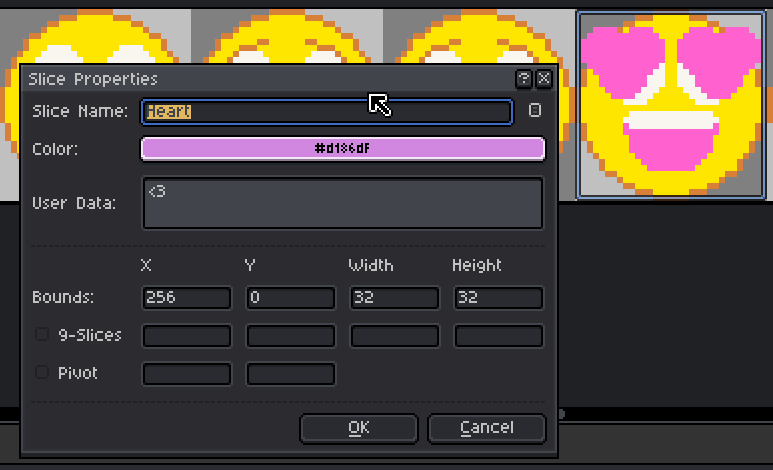

# Peachy
A parser/renderer for Aseprite animations in LÖVE.

# How to use
Draw some animations in Aseprite and export the file as a spritesheet:


Make sure that you export JSON data with frame tags and that you have at least one tag defined. Even if there is a single animation in the file, you **still** need to set up frame tags.

```lua
-- Load an aseprite animation file called spinner.json, with the image
-- spinner.png & start with the animation tag "Spin"
spinner = peachy.new("spinner.json", love.graphics.newImage("spinner.png"), "Spin")

function love.draw()
  -- Draw at 50,50
  spinner:draw(50, 50)
end

function love.update(dt)
  spinner:update(dt)
end
```

If you don't specify an image to load in new by passing nil or false as the second argument, then peachy will attempt to load the image specified in the data file. This can cause problems: see [limitations below](#limitations).

# Examples
See main.lua for further examples:


# Slices
We can also draw and use [slices](https://www.aseprite.org/docs/slices/). These are essentially named regions on the image which can also contain custom user data. 



# API Reference
- `peachy.new(data: string|table, image?: Image, initialTag?: string) -> peachy` - Creates a new animation object

## Peachy
### Functions
- `:play()` - Resumes the animation
- `:pause()` - Pauses the animation
- `:stop(onLast?: boolean)` - Stops the animation and returns to first (or last) frame
- `:togglePlay()` - Toggles between playing and paused
- `:setTag(tag: string)` - Switches to a different animation tag
- `:setFrame(frame: integer)` - Jumps to a specific frame index (1-based)
- `:getTag() -> string?` - Returns the current tag name
- `:getFrame() -> integer?` - Returns the current frame index
- `:draw(x: number, y: number, rot?: number, sx?: number, sy?: number, ox?: number, oy?: number)` - Draws the current frame
- `:update(dt: number)` - Updates the animation timer
- `:getWidth() -> number` - Returns the width of the current frame
- `:getHeight() -> number` - Returns the height of the current frame
- `:getDimensions() -> number, number` - Returns both width and height of the current frame
- `:getSlice(name: string) -> Slice?` - Gets a [slice](#slice) by name. Returns nil if not found
- `:getSliceNames() -> string[]` - Returns an array of all [slice](#slice) names
- `:hasSlice(name: string) -> boolean` - Checks if a [slice](#slice) with the given name exists
- `:drawSlice(name: string, x: number, y: number, rot?: number, sx?: number, sy?: number, ox?: number, oy?: number)` - Draws a [slice](#slice) at the specified position
- `:onLoop(callback: function, ...)` - Sets a callback function to be called when the animation loops

### Properties
- `paused: boolean` - Boolean indicating if the animation is paused
- `frameIndex: integer` - Current frame index
- `tagName: string` - Current animation tag name

## Slice
A slice object representing a named rectangle in the image.

### Properties
- `bounds: {x: number, y: number, w: number, h: number}` - The bounding rectangle of the slice
- `quad: Quad` - The quad used for rendering this slice
- `color: number[]?` - Normalized RGBA colour values (0-1) (the border colour - at least in Aseprite)
- `data: string?` - Custom user data

# Limitations
* By default Aseprite will export a **non-relative** path as the image file. This is problematic because LÖVE will refuse to load it and it's non-portable. There's a workaround listed [here](https://github.com/aseprite/aseprite/issues/1606). Either specify the image yourself in `peachy.new`, edit the JSON manually or use the CLI.
* Exported sprite sheets **must** be exported as an array, **not** as a hash table.

* Slices don't animate. This is a limitation of Aseprite as far as I'm aware, slices are just regions on an image, not a frame cel. When the [new layer types](https://github.com/aseprite/aseprite/pull/5347) come in there will be tools better suited for drawing hitboxes etc.