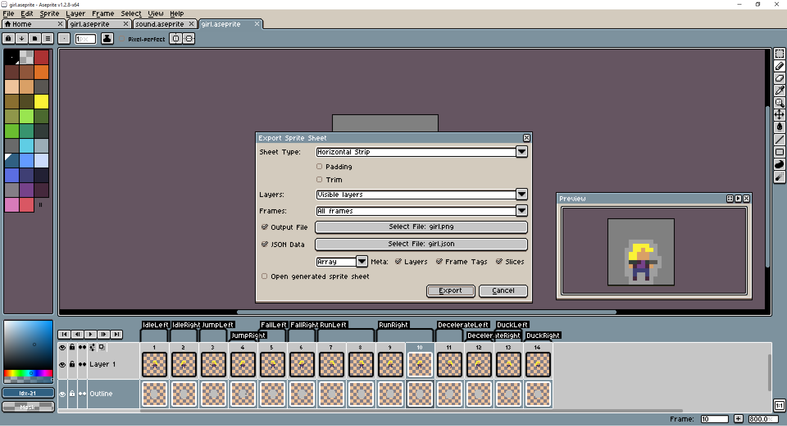
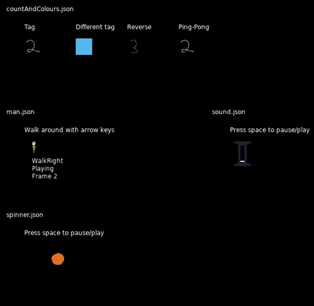
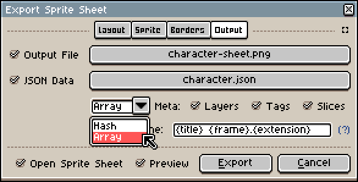

# Peachy
A parser/renderer for Aseprite animations in LÖVE.

# How to use
Draw some animations in Aseprite and export the file as a spritesheet:


Make sure that you export JSON data with frame tags and that you have at least one tag defined. Even if there is a single animation in the file, you **still** need to set up frame tags.

```lua
-- Load an aseprite animation file called spinner.json, with the image
-- spinner.png & start with the animation tag "Spin"
spinner = peachy.new("spinner.json", love.graphics.newImage("spinner.png"), "Spin")

function love.draw()
  -- Draw at 50,50
  spinner:draw(50, 50)
end

function love.update(dt)
  spinner:update(dt)
end
```

If you don't specify an image to load in new by passing nil or false as the second argument, then peachy will attempt to load the image specified in the data file. This can cause problems: see limitations below.

# Examples
See main.lua for further examples:



# Documentation
[Documentation is hosted on GitHub pages](https://josh-perry.github.io/peachy/) from the `docs` folder in this repository.

They're written in [LDoc](https://github.com/stevedonovan/LDoc/) in [peachy.lua](peachy.lua) if you want to make a change to them.

## Building
If you want to build the documentation yourself for whatever reason then:

* install [LDoc](https://github.com/stevedonovan/LDoc/)
* Run `ldoc.lua peachy.lua -d docs`

This will build them into the docs directory.

# Limitations
* By default Aseprite will export a **non-relative** path as the image file. This is problematic because LÖVE will refuse to load it and it's non-portable. There's a workaround listed [here](https://github.com/aseprite/aseprite/issues/1606). Either specify the image yourself in `peachy.new`, edit the JSON manually or use the CLI.
* Exported sprite sheets **must** be exported as an array, **not** as a hash table.

